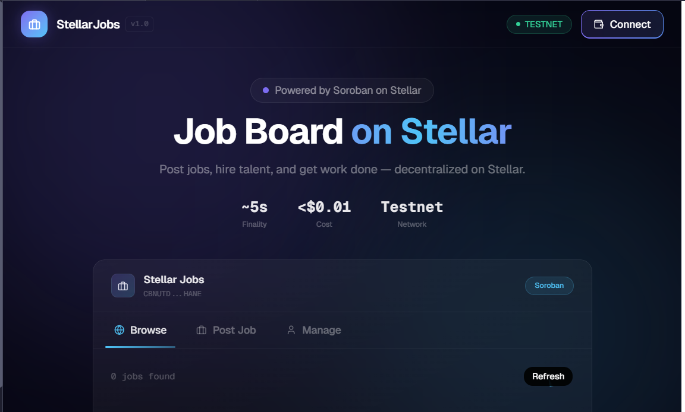
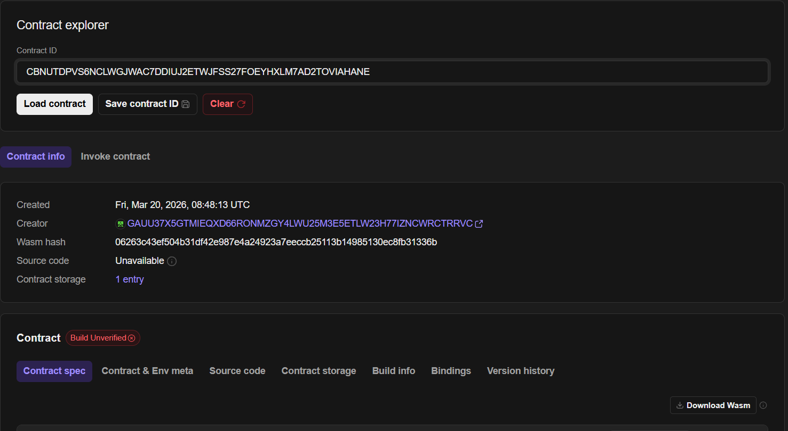

# Decentralized Job Board

A Web3-based job marketplace where employers and job seekers interact directly using blockchain smart contracts, removing intermediaries and ensuring transparency.



---


## Overview

This is a decentralized application (dApp) that allows:

* Employers to post jobs on-chain
* Candidates to apply using their wallet
* Smart contracts to manage job listings and applications

The goal is to eliminate centralized control and create a trustless hiring system.

---

## Features

* Smart contract-based job postings
* Employers can create and manage jobs
* Users can browse and apply for jobs
* Fully decentralized interaction
* Transparent and immutable records

---

## Tech Stack

* Frontend: React / Next.js
* Blockchain: Soroban (Stellar Smart Contracts)
* Language: Rust
* Web3 Integration: Stellar SDK / Freighter API
* Wallet: Freighter Wallet

---

## Project Structure

```
contract/       # Soroban smart contracts (Rust)
  contracts/    # Contract source code
client/         # Frontend Next.js application
  app/          # Next.js App Router pages
  components/   # UI components
  hooks/        # Stellar/Soroban hooks
```

---

## Smart Contract

Add your deployed contract details here after deployment:

```
Network: Stellar Testnet
Contract Address: CBNUTDPVS6NCLWGJWAC7DDIUJ2ETWJFSS27FOEYHXLM7AD2TOVIAHANE
```

To use this contract in the frontend, ensure `client/hooks/contract.ts` has:
```typescript
export const CONTRACT_ADDRESS = "CBNUTDPVS6NCLWGJWAC7DDIUJ2ETWJFSS27FOEYHXLM7AD2TOVIAHANE";
```



---

## Future Improvements

* Reputation system
* Escrow-based payments
* AI-powered job matching
* Multi-chain support

---

## Limitations

* Requires crypto wallet
* Gas fees may apply
* Not beginner-friendly for non-Web3 users

---

## Contributing

Feel free to fork the repo and submit pull requests.

---

## License

MIT License

---

## Author

Arya Bhagat
